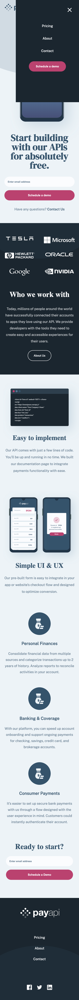
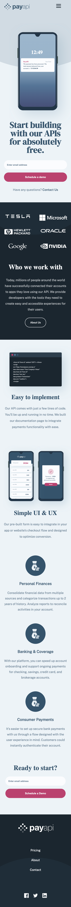
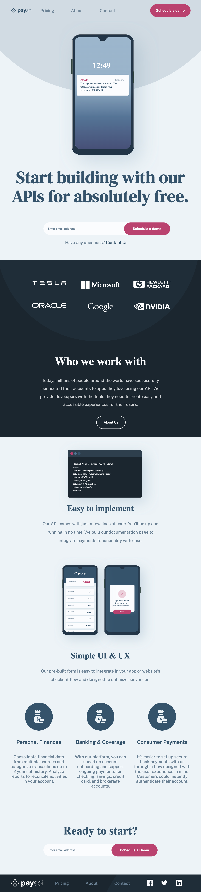
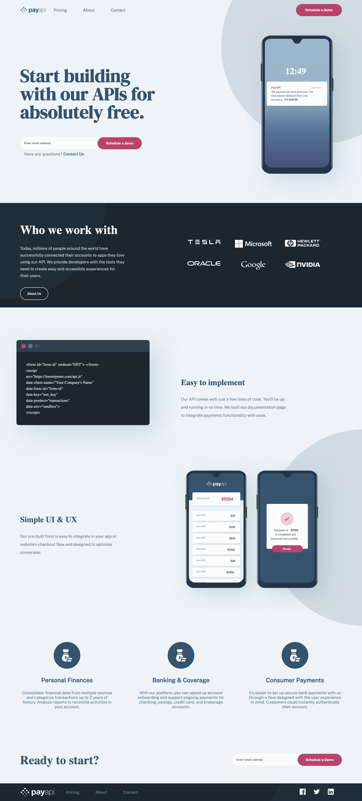
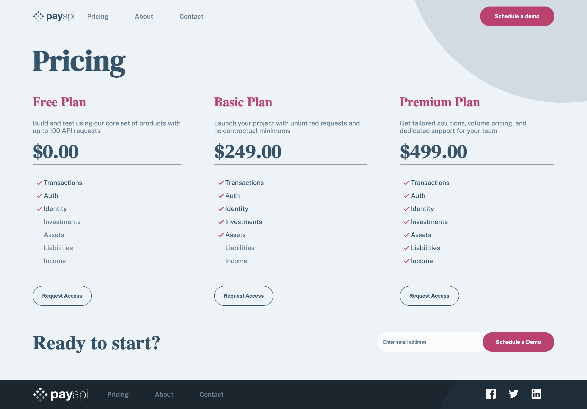
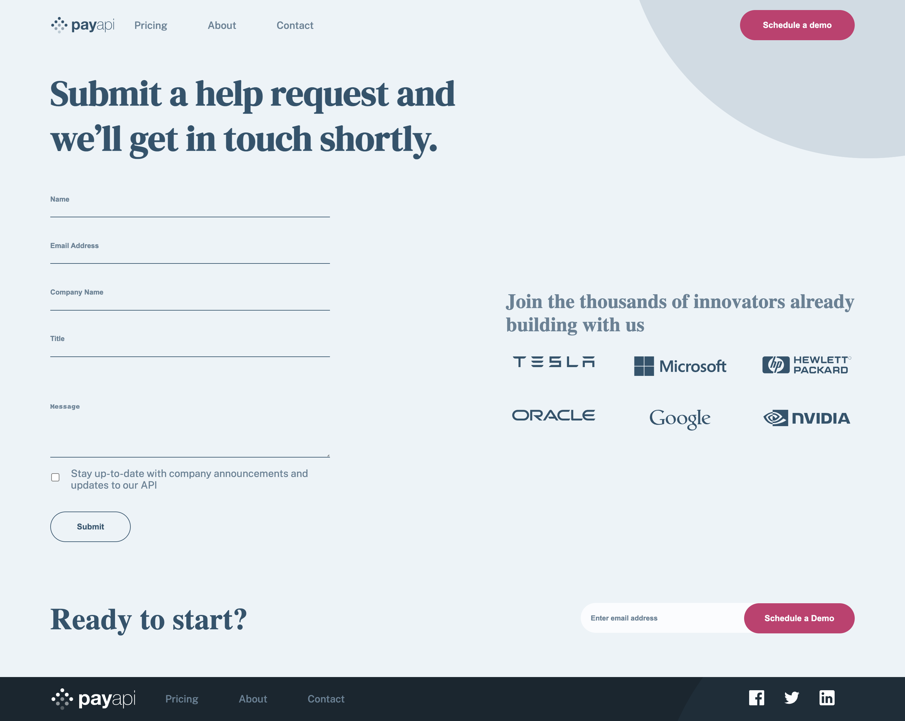

# Frontend Mentor - PayAPI multi-page website solution

This is a solution to the [PayAPI multi-page website challenge on Frontend Mentor](https://www.frontendmentor.io/challenges/payapi-multipage-website-FDLR1Y11e). Frontend Mentor challenges help you improve your coding skills by building realistic projects. 

## Table of contents

- [Overview](#overview)
  - [The challenge](#the-challenge)
  - [Screenshot](#screenshot)
  - [Links](#links)
- [My process](#my-process)
  - [Built with](#built-with)
  - [What I learned](#what-i-learned)
  - [Continued development](#continued-development)
  - [Useful resources](#useful-resources)
- [Author](#author)
- [Acknowledgments](#acknowledgments)

## Overview

### The challenge

Users should be able to:

- View the optimal layout for each page depending on their device's screen size
- See hover states for all interactive elements throughout the site
- Receive an error message when the contact form is submitted if:
  - The `Name`, `Email Address` or `Message` fields are empty should show "This field can't be empty"
  - The `Email Address` is not formatted correctly should show "Please use a valid email address"

I added some additional features to this project: 

- Contact form data to google sheets: the submitted data will be sent and stored in a google sheet. To achive this I used an API script from Jamie Wilson [Folder of Jamie Wilson´s code](https://github.com/jamiewilson/form-to-google-sheets) and I built in into my project. (Modifications - see below at "what I have learned" part) In the Javascript file I made some modifications to fit my project. My project has more forms. I divided the forms into 2 types - a contact form for help requests and a form for demo requests which only accepts an email Accordingly the data will be submitted into 2 separate google sheets.

Under this link you can find the project folder which needed to connect the form with the google sheet.[Form to google sheets](https://github.com/jamiewilson/form-to-google-sheets).

### Screenshot
















### Links

- Solution URL: [Github Repo](https://github.com/MirMurr/payapi)
- Live Site URL: [Live site](https://mirmurr.github.io/payapi/index.html)

## My process

### Built with

- Semantic HTML5 markup
- CSS3
- Flexbox
- CSS Grid
- Mobile-first workflow
- API script 

### What I learned

I have learned a lot on this project, it was a complex layout challenge, especially on the homepage. What I am really glad about that I have found a useful video on the JS regex topic. I have internalized the basics of regex and based on that I wrote a regex for the email validation. See below what I have learned on this project:

# CSS

This project was a nice layout challenge with the circle images. I have learned the following things in CSS:

- Setting a min-width in pixels on the image-container solves the issue that the image shrinks too much and disappears under a certan screen-width. 

- applying transform: translateX(), transform: translateY() properties to position the image also in responsive layouts.

```css
.circle-img-container {
        width: 50%;
        min-width: 600px; 
        position: absolute;
        right: -10rem;
        transform: translateX(10rem);
        top: -35rem;
        transform: translateY(22rem);
        z-index: 0;
    }
```

- the filter: invert css property. The problem was that the provided logo´s color was blue, same blue as the footers background. That´s why I needed to find a way to change the color of the image to white (as it´s white in the design file). I have used the above property on the image´s container.

```css
footer .logo-container {
    filter: invert(10%) hue-rotate(100deg) brightness(240%) contrast(240%);
}
```

- The pricing page displays an unordered list, some elements with checkmarks, some without. In the HTML file the  <li> tags, which have a checkmark next to them have the "checked" class. To display the checkmarks next to the <li> tags, I have used the above css property: 

```css
.pricing-container-main li.checked {
    list-style-image: url(./assets/shared/desktop/icon-check.svg);
}
```

# JavaScript

- This project contains multiple forms. I divided them into 2 categories: there´s one contact form which is for help requests. The other one is a single e-mail input form which is for scheduling a demo. 

- Regex for form validation. I have found this video [LINK] (Webdev simplified youtube video), which explains JS regex briefly and very well. After I have learned the basics from the video and I have written a regex for the e-mail validation:

At the end {2,4} means that it takes e-mail addresses with 2-4 FORGOT THE NAME OF THIS THING with at least 2 letters and maximal 4 letters (however the maximal number doesn´t have an effect, longer ______ will be submitted too).

 ```js
 const myRegex = /([a-zA-Z0-9.!#$%&'*+-/=?^_`{|}~]+)@([a-zA-Z0-9]+)\.([a-zA-Z]{2,4})/;
 ```

- I have added a function which hides the error messages on click in the help request form. I have more error messages, that´s why I converted them into an array and added an eventListener to each items by the forEach() method. If the user starts to type, then the errormessage will disappear too. 

```js
const errorElements = [errorElement, errorForName];

emailInput.addEventListener('click', () => {
    emailInput.value = '';
    errorElements.forEach(element => {
        if (element.style.display === 'block') {
            element.style.display = 'none';
        } else {
            element.style.display = 'none';
        }
    });

    errorElements.forEach(element => {
        if (emailInput.value.length >= 1) {
            element.style.display = 'none';
        }
    })
});
```

- use trim() method in e-mail validation. It trims the space before and after the userinput. 

```js
if (emailInput.value.trim() === '' || emailInput.value.trim() == null) {
        errorMessages.push('E-Mail Address is required');
    }
```

- I have written a validation for the other form, cause it will be submitted to another googlesheet. I have built the form submission into my validateReady() function. The submitEvent() function submits the data from the form if the validateReady() function´s conditions apply. At last I added an eventlistener to the buttons to submit the data.

```js
function validateReady(e) {
    for (let i = 0; i < emailInputs.length; i++) {
        let errorMessages = []
        let emailInput = emailInputs[i]
        let errorElementReady = errorElementsReady[i]
        let readyForm = readyForms[i]

        if (emailInput.value.trim() === '' || emailInput.value.trim() == null) {
            errorMessages.push('E-Mail Address is required');
        }

        else if (emailInput.value.trim().match(myRegexReady) == null) {
            e.preventDefault()
            errorMessages.push('Please enter a valid e-mail address');
        }

        if (errorMessages.length > 0) {
            e.preventDefault()
            errorElementReady.innerHTML = errorMessages.join(', ')
        } else {
            errorElementReady.innerHTML = '';
            e.preventDefault() // this part is from the script which was written by Jamie Wilson -start
            fetch(scriptURL, { method: 'POST', body: new FormData(readyForm)})
                .then(response => console.log('Success!', response))
                .catch(error => console.error('Error!', error.message)) // this part is from the script which was written by Jamie Wilson - end
            return 
        }
    }
}

function submitEvent() {
    for (let i = 0; i < readyForms.length; i++) {
        let readyForm = readyForms[i]
        readyForm.addEventListener('submit', validateReady)
    }
}

for (let i = 0; i < submitButtonsDemo.length; i++) {
    let submitButtonDemo = submitButtonsDemo[i];
    submitButtonDemo.addEventListener('click', submitEvent)
}

```

### Continued development
- Javascript: building more complex projects and improving my logic
- CSS: building complex layouts, might apply bootstrap as well to make the building process faster
- HTML accessibility 
- writing clean W3C valid HTML code.

### Useful resources

- [Jamie Wilson API script](https://github.com/jamiewilson/form-to-google-sheets) - I built in his script into my project to be able to store and submit form data in google sheets.
- [Webdev simplified YouTube video learn regex](https://www.youtube.com/watch?v=rhzKDrUiJVk) - This video on regex explained what each carachters in a regex mean and after watching and learning this video I was able to create a regex for email validation.

## Author

- Website - [Add your name here](https://www.your-site.com)
- Frontend Mentor - [@MirrMurr](https://www.frontendmentor.io/profile/yourusername)

## Acknowledgments

The API script by Jamie Wilson is great to submit data into googlesheets. The description is detailed and can be easily applied. 

Webdev Simplified YouTube channel is always a great ressource when I want to learn something new.
